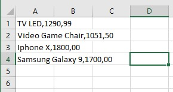

# Manipulação de arquivos com Java
**O programa faz a leitura de um arquivo .txt, em seguida o programa cria um outro arquivo .csv com as informações contidas no arquivo .txt**

Documento de texto a ser lido pelo programa

Console : 

O programa cria uma pasta chamada "out":

Em seguida é criado uma pasta chamada "summary.csv" dentro da pasta out: 

(conteudo summary)

